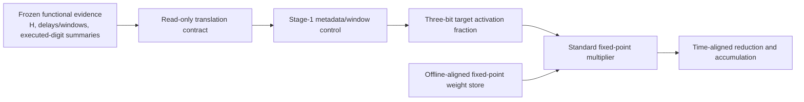

# Active hardware architecture contract

Status: **draft; corrected M1 arithmetic frozen, microarchitecture open**
Last updated: 2026-08-01
Implementation status: no active circuit-reference or RTL datapath yet

This document is the source of truth for the redesigned hardware simulator.
M1 fixes its arithmetic. It deliberately stops short of choosing the
cycle-visible microarchitecture that remains for M2.

## 1. Method identity

The paper studies **temporal significance scheduling**. The scheduled object is
a **local execution window on an aligned contribution stream**. The frozen
software metric remains **executed-digit ratio**.

The hardware realizes the schedule by forming a target activation mantissa and
using a conventional fixed-point multiplication with a weight element whose
element exponent was aligned offline. Activation and block exponents remain
temporal alignment information; they are not expanded into a wide activation
operand. The design is not a generic sparsity mask and is not a runtime
two-sided digit-serial multiplier.

## 2. Binding system boundary

The custom hardware scope covers the stage-1 `gate_proj` and `up_proj` work
needed by the revised datapath and its local metadata/control/storage.



Explicitly excluded from custom scope:

- a custom stage-2 `down_proj` engine;
- a stage-1/stage-2 packet interface;
- packetization, boundary headers, payload compression, or payload FIFOs;
- shard routing, elastic queues, or queue replay;
- a runtime recoded weight-digit stream;
- old Anchor-2 serial leaf timing or energy coefficients.

`down_proj` remains part of the frozen full-model quality evidence. It may be a
common, unchanged denominator term in a declared full-FFN comparison, but it
is not part of the new custom RTL.

## 3. Corrected frozen M1 arithmetic contract

The binding operand-format configuration is
[`tss-m1-mxfp8-m3a4w8-p12-acc52-v3`](../configs/operand_format_m1_v3.json).
The reviewed vectors are in
[`tss-m1-arithmetic-v3`](../fixtures/m1_arithmetic_vectors_v3.json). The hashed
milestone record is
[`tss-m1-arithmetic-freeze-v3`](../configs/m1_arithmetic_freeze_v3.json).
Changing any equation, width, binary point, offset, rounding rule, or overflow
rule requires a new configuration ID and reopens M1.

The former `a20w19` contract is superseded. It incorrectly encoded the
activation element exponent as a Q17 spatial shift and then NAF-prefixed that
wide word. The later v2 correction restored temporal activation alignment but
kept an exact 19-bit Q17 weight. This v3 contract preserves the corrected
schedule while replacing that expensive weight with one rounded signed 8-bit
Q6 word and re-deriving every dependent width.

### 3.1 Source decode and normalized activation significand

The canonical source element is finite MXFP8 E4M3FN. For raw fields `s`, `e`,
and `f`, decode an exact signed Q9 integer `q_int`:

```text
mag_int = f                         if e = 0
        = (8 + f) << (e - 1)        otherwise
q_int   = (-1)^s * mag_int
q       = q_int * 2^-9
```

`e = 15, f = 7` is NaN and rejected. Both zero encodings canonicalize to
integer zero and positive sign. For a nonzero element:

```text
e_v       = floor(log2(abs(q)))
M_v_int   = abs(q) * 2^(-e_v) * 2^3
q         = sign(q) * M_v_int * 2^(e_v - 3)
```

`M_v_int` is exact and lies in `[8, 15]`, including for subnormals after
normalization. It is a four-bit unsigned `1.xxx` significand with three
fraction bits. The explicit activation target therefore contains three bits;
the leading one and sign are represented separately when a target is active.

The frozen block quantizer divides a nonzero block by `max_abs / 448`. Its
maximum normalized element consequently has element exponent `8`. Both the
activation and weight element-reference exponent are therefore the fixed
format constant:

```text
ELEM_REF_X = ELEM_REF_W = 8
```

They are not variable per-block metadata. A trace adapter must reject a
purported legal nonzero source block that violates this quantizer invariant
rather than inventing `rho_x`, `rho_w`, `gamma_x`, or `gamma_w` fields.

### 3.2 Temporal alignment and schedule

`beta_x` and `beta_w` are decoded integer base-2 block-scale exponents; M2
owns their port encoding and width. The runtime control equations are:

```text
E_raw[b] = beta_x[b] + beta_w[b]
E_max    = max_b E_raw[b]
D[b]     = E_max - E_raw[b]

lambda_x[b,k] = 8 - e_x[b,k]
tau[b,k]      = D[b] + lambda_x[b,k]
L[b,k]        = max(0, H - tau[b,k])
p_eff_frozen  = max(0, H - tau[b,k] - 2)
R[b,k]        = min(3, p_eff_frozen)
```

Thus the activation block scale and weight block scale set the coarse arrival,
and the activation element exponent refines it. The weight element exponent is
absent from runtime control because it is represented inside the offline
fixed-point weight. The two fixed element-reference exponents contribute a
common numeric factor; they cancel from `D` and do not belong in `E_raw`.

The legal horizon range is `[0, 31]`. The constant two preserves the origin of
the frozen horizons calibrated with `msd_online_delay = 2`; it is a translation
constant, not the latency of the standard multiplier. A zero activation uses
the sentinel `lambda_x = 31`, forms no target, and makes no numeric
contribution. All-zero blocks are killed. If every candidate block is killed,
`E_max`, the accumulator, and overflow are canonical zero.

### 3.3 Three-bit target activation mantissa

Let `frac_norm = M_x_int[2:0]`. For `R` in `[1, 3]`, retain the `R` most
significant explicit fraction positions and clear the rest:

```text
keep_mask(R) = ((1 << R) - 1) << (3 - R)
frac_target  = frac_norm & keep_mask(R)
A_sig_int    = 8 | frac_target
```

`frac_target` is the three-bit target payload. `A_sig_int` is the four-bit
unsigned UQ1.3 magnitude presented to the standard multiplier; activation sign
is a one-bit sideband applied to the product. For `R = 0` or zero activation,
the target is invalid/zero and there is no numeric multiply contribution.

This is binary prefix clearing over the three E4M3 fraction positions. It is
not a NAF conversion and cannot create the former `+2.0` overshoot. A literal
implementation may infer a four-bit magnitude multiplier or realize the
implicit-one term separately, but it must be numerically equivalent to
`A_sig_int * W_aligned_int`.

### 3.4 Offline-aligned fixed-point weight

For a weight element, offline preparation folds its sign, element exponent,
and mantissa into a signed fixed-point word referenced to exponent `8`, then
performs the design's one offline weight-rounding operation:

```text
W_aligned_value = sign(w) * m_w * 2^(e_w - 8)
W_aligned_int   = RNE(W_aligned_value * 2^6)
                = RNE_signed(decode_q9(w) / 2^11)
```

`RNE` means round to nearest with ties to even, applied symmetrically to
negative values. `W_aligned_int` is signed 8-bit Q6. All finite E4M3FN values
round into `[-112, 112]`, so legal encoding never saturates or overflows;
small source weights may intentionally round to zero. Runtime reads this byte
directly. It does not decode or shift `e_w`, and it does not receive a
per-block weight reference exponent. `beta_w` remains online metadata solely
because it contributes to `E_raw` and `D`.

The canonical artifact packing is exactly one byte per logical weight, with no
padding or byte-order convention beyond element order. Physical SRAM banking
and port organization remain M2 decisions.

### 3.5 Multiply, time placement, reduction, and accumulation

The numeric formats are fixed:

| Quantity | Encoding | Width | Fraction bits |
|---|---|---:|---:|
| Target fraction payload | unsigned binary prefix | 3 | positions of E4M3 `f` |
| Active activation significand | unsigned UQ1.3 plus sign sideband | 4 | 3 |
| Offline-aligned weight | two's complement | 8 | 6 |
| Element product | two's complement | 12 | 9 |
| Common-tail temporal product | two's complement | 40 | 37 |
| Exact 32-element block sum | two's complement | 45 | 37 |
| Channel accumulator | two's complement | 52 | 37 |

For an active target:

```text
P_element_int = (-1)^activation_sign * A_sig_int * W_aligned_int
```

This is a full-precision four-bit-magnitude by signed-8-bit standard multiply,
with no product rounding or saturation. The result fits signed 12-bit Q9. The
only weight precision loss happened in the offline encoder in Section 3.4.

Alignment remains temporal. With `H <= 31` and the two-position calibration
offset, an active target satisfies `tau <= 28`. Define the common reference
tail `T_REF = 28`. The bit-exact fixed-point oracle represents placement at
arrival `tau` as:

```text
P_temporal_int = P_element_int << (T_REF - tau)
```

This left shift is a mathematical common-tail encoding for verification. It
does not authorize a Q17 activation operand or require a runtime activation
barrel shifter: the microarchitecture must realize the same significance
placement with timing/valid control. There is no rounding at temporal
alignment.

Up to 32 temporal products sum exactly in signed 45-bit Q37. Up to 128 block
sums accumulate in signed 52-bit Q37, in increasing block order:

```text
block_sum_int = sum_k P_temporal_int[k]
acc_next      = sat52(acc + sign_extend(block_sum_int))
output_value  = acc_int * 2^(E_max - 21)
```

Each update saturates to `[-2^51, 2^51 - 1]` and sets a sticky overflow flag.
Overflow is unreachable for at most 4096 legal elements; saturation defines
defensive behavior for malformed traffic. There is no final narrowing inside
the custom stage-1 scope. The output scale restores both the Q6 weight
reference and the activation's temporal exponent; equivalently, the rounded
source-domain weight represented by a stored integer is
`W_source_rounded = W_aligned_int * 2^(8 - 6)`.

### 3.6 Offline/runtime responsibilities

| Item | Prepared offline | Runtime responsibility |
|---|---|---|
| Horizon `H[p,c]` | Calibrate and version the integer table | Read the selected channel value |
| Weight block | Decode finite MXFP8; emit `beta_w`, signed-RNE 8-bit Q6 words, zero metadata, and one-byte element order | Read `beta_w` during prepass and one aligned byte for a selected element |
| Activation block | Source quantization remains a frozen numerical input | Read `beta_x`, activation sign/exponent/fraction, decode `lambda_x`, and normalize subnormals |
| Coarse schedule | None | Form `E_raw`, `E_max`, and `D` from `beta_x` and `beta_w` only |
| Local target | Prefix rule and configuration ID are static | Form `tau`, `L`, `R`, the three-bit fraction prefix, and the implicit-one/sign multiplier operand |
| Datapath result | Widths and precision rules are static | Multiply once, place the result at `tau`, reduce exactly, and accumulate |
| Frozen software evidence | Preserve original horizon, PPL, and `p_eff` provenance | Translate only the documented `R = min(3, p_eff_frozen)` descriptor; do not recompute PPL |

### 3.7 Frozen-software interpretation boundary

The frozen simulator NAF-truncates `q_x * q_w` using the original MXFP8 weight.
This hardware contract clears low binary activation-fraction positions,
multiplies the resulting significand by a newly rounded 8-bit aligned weight,
and places that product at `tau`. Those operations are not generally
numerically identical. The two-position offset and
`R = min(3, p_eff_frozen)` transfer the stored schedule descriptor, not the
frozen numerical oracle. Frozen PPL and executed-digit results retain their
original provenance, do not include the 8-bit weight rounding, and cannot be
claimed as RTL output quality.

## 4. Runtime transaction boundary

A hardware transaction must identify at least:

- source artifact and schema revision;
- model, layer, projection (`gate_proj` or `up_proj`), token/sample, output
  channel, and input block coordinates as applicable;
- the operand-format configuration ID and raw MXFP8 source words;
- `beta_x`, `beta_w`, `H`, `D` or the metadata needed to reproduce it, and
  the activation element descriptor;
- the offline-aligned weight element or a deterministic fixture reference;
- expected target, product, temporal placement, reduction, result, and event
  counts for verification.

The first implementation should use tiny synthetic transactions. It must not
require a full model trace, calibration run, or PPL run.

## 5. Metadata and control reuse boundary

The old scale prepass and window builder remain reference candidates only.

- The add/max/subtract structure of the `E_raw`/`E_max`/`D` prepass remains
  valid with `beta_x` and `beta_w`. There are no active `rho` or `gamma`
  operands.
- The `tau`/`L` arithmetic remains valid. Active configuration carries `R` or
  an exactly equivalent three-bit prefix descriptor; it does not carry a
  product-digit remaining counter.
- The old `rem_ctr`, product-digit pointer, `subtree_init`, and configuration
  word are not active contract fields.
- Horizon, raw-exponent, delay, and generic synchronous storage are candidates;
  completion metadata and payload storage are retired.

No extracted legacy module enters an active RTL filelist until its ports and
semantics are reviewed against this document.

## 6. Reduction and accumulation boundary

M1 freezes the 12-bit leaf product, temporal arrival semantics, exact 45-bit
block sum, and 52-bit saturating channel result. M2 must still freeze the
physical realization of temporal placement, reduction topology,
multiplier/reduction sharing, pipeline placement, and cycle model. A topology
is bit-equivalent only if it preserves the M1 common-tail sum.

The reference model and RTL must agree bit-for-bit on:

- each target fraction/significand and element product;
- each product's temporal arrival/significance placement;
- reduction order where defensive saturation makes it observable;
- accumulated output and sticky overflow;
- all ledger events owned by the transaction.

## 7. Comparison boundary

Every evaluation configuration must declare one of these scopes:

- `stage1_custom`: only the redesigned gate/up custom work;
- `ffn_e2e`: revised stage-1 work plus explicitly identified common SiLU,
  gating, `down_proj`, and noncustom terms;
- `model_e2e`: full-model accounting with measured or clearly labeled common
  terms.

Do not compare a stage-1 numerator with an old full-FFN denominator without a
written decomposition. The old 4.253% decode and 8.014% prefill results are
retired hardware values, not defaults.

## 8. Open items blocking architecture freeze

The architecture is not frozen merely because the arithmetic equation is
known. Both arithmetic and cycle-visible microarchitecture must be decided so
that implementation, verification, synthesis, and later layout all target one
stable design.

### 8.1 Resolved corrected M1 decisions

| Former ID | Resolution |
|---|---|
| `OPEN-ARCH-001` | Three-bit normalized activation-fraction prefix with `R = min(3, p_eff_frozen)`; HW-D015 |
| `OPEN-ARCH-002` | Three-bit target payload, four-bit UQ1.3 multiplier magnitude, and sign sideband; HW-D015 |
| `OPEN-ARCH-003` | Fixed-reference weight alignment with element exponent folded offline and signed nearest-even quantization; HW-D014 and HW-D017 |
| `OPEN-ARCH-004` | Signed 8-bit Q6 logical weight word and one-byte element packing; HW-D017 |
| `OPEN-ARCH-005` | Full 12-bit product, exact temporal placement, 45-bit block sum, and 52-bit accumulator; HW-D018 |
| `OPEN-ARCH-008` | `D` uses `beta_x + beta_w`; no runtime weight element/reference exponent; HW-D014 |

### 8.2 Microarchitecture and implementation-boundary decisions

| ID | Required decision | Why it blocks design freeze |
|---|---|---|
| `OPEN-ARCH-006` | Multiplier issue granularity, lane count, path sharing, and block organization | Determines throughput, area, ledger, and cycle model |
| `OPEN-ARCH-007` | Physical temporal-placement/reduction topology and accumulator update boundary | Determines RTL structure and cycle-visible behavior |
| `OPEN-ARCH-009` | Top-level transaction ports, valid/ready behavior, ordering, backpressure, and reset semantics | Freezes the integration and testbench boundary |
| `OPEN-ARCH-010` | Pipeline stages, multiplier latency/initiation interval, block completion, and channel completion schedule | Prevents timing closure from changing functional latency later |
| `OPEN-ARCH-011` | Activation, aligned-weight, metadata, configuration, and accumulator storage organization and read/write ports | Determines synthesizable memory boundaries and floorplan-facing state |
| `OPEN-ARCH-012` | Clock/reset structure, target clock period, area/timing guardrails, pre-layout margin, clock-enable policy, and timing-exception policy | Determines constraints and mapped feasibility acceptance |
| `OPEN-ARCH-013` | Canonical instantiated parameters, module hierarchy, synthesis top, and physical handoff boundary | Ensures characterization and layout use one design rather than a parameter sweep |
| `OPEN-ARCH-014` | Power-domain/power-gating intent and DFT/scan/test-port boundary, including an explicit decision that a feature is absent | Prevents physical implementation from silently adding functionally visible architecture |

`OPEN-ARCH-006`, `OPEN-ARCH-007`, and `OPEN-ARCH-009` through
`OPEN-ARCH-014` remain open. Resolve them in the decision log and mark this
contract `frozen` at M2. Integrated active RTL begins only after every decision
it instantiates is frozen.

## 9. Contract freeze checklist

Corrected M1 complete:

- worked full, one-bit, two-bit, negative, zero, subnormal, extrema,
  maximum-arrival, killed-window, temporal-reduction, and overflow-policy
  examples;
- exact offline/runtime responsibilities and the relation to `H`, `D`,
  `lambda`, `tau`, and frozen executed-digit evidence;
- immutable v3 operand-format ID and bit-exact expected words suitable for RTL
  smoke tests;
- explicit separation of the three-bit target payload, implicit leading bit,
  activation sign, and rounded 8-bit aligned weight;
- exhaustive finite-source weight encoding checks, including positive and
  negative ties-to-even, zero rounding, and extrema;
- explicit statement that target-mantissa hardware is not the frozen
  product-first numerical oracle.

Remaining for M2:

- one canonical microarchitecture/configuration ID with no unresolved
  parameters;
- exact top-level ports, clock, reset, backpressure, ordering, latency, and
  initiation interval;
- exact multiplier-lane sharing, physical temporal-placement/reduction
  topology, and accumulator update schedule;
- storage depth, width, banking, ports, initialization, and inference or macro
  boundary defined for every array;
- a target clock and complete pre-layout timing-constraint policy;
- area/timing guardrails, required pre-layout margin, power intent, and
  testability boundary recorded;
- a cycle-annotated fixture whose expected acceptance, product, reduction,
  accumulation, and completion cycles can be calculated without reading RTL.

Meeting this checklist produces an **architecture freeze**, not yet a
layout-ready design. The additional RTL, verification, and synthesis closure
required for **design-mature** status is defined in `development_plan.md`.
