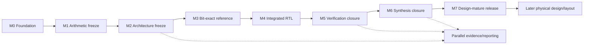

# Hardware simulation development plan

Status: **corrected M1 arithmetic freeze complete; M2 architecture freeze next**
Last updated: 2026-08-01
Target: **one design-mature RTL release ready for physical-design handoff**

The goal is not merely runnable RTL. We will mature one canonical hardware
design until later layout work can focus on physical implementation without
reopening arithmetic, scheduling, pipeline, storage, or interface decisions.

Full-model PPL is not hardware verification. Model-scale accounting and paper
reporting are parallel evidence work; they do not replace the freeze,
bit-exact verification, or synthesis gates below.

## 1. Design-mature exit state

The hardware is **design-mature** only when:

- `architecture_contract.md` is `frozen` with no open `OPEN-ARCH-*` item;
- one canonical operand and microarchitecture configuration is selected;
- arithmetic results and cycle-visible behavior are independently calculable;
- top-level protocol, clock/reset, pipeline, throughput, storage, hierarchy,
  constraints, power intent, and testability boundary are frozen;
- the Python reference and integrated RTL agree on bits, cycles, transaction
  order, and event counters across the canonical regression;
- canonical RTL synthesizes without unresolved functional warnings or
  unintended black boxes;
- generic and Nangate-mapped synthesis meet the frozen area/timing guardrails
  and required pre-layout margin;
- post-synthesis equivalence or equivalent netlist parity passes;
- an immutable freeze manifest identifies every source, config, schema,
  constraint, test, report, tool version, and checksum used by the release.

This is a layout-ready RTL/handoff state, not post-layout signoff. If mapped
feasibility requires changing the design, we return to the affected milestone
before calling it mature.

## 2. Critical path

Milestones close in order. Prototypes may explore later work, but a later gate
cannot close using provisional decisions from an earlier one.

## 3. M0 — Repository and provenance foundation

Status: **complete**

The repository split, frozen functional boundary, stage-1-only scope,
standard-multiplier decision, evidence labels, cleared technology files,
legacy quarantine, and generated-artifact boundary are established.

M0 remains valid only while hardware work does not mutate the functional or
Transformers simulations and does not depend on `../anchors` or `../rebuttal`.

## 4. M1 — Arithmetic and schedule freeze

Status: **complete after v3 8-bit-weight correction**

Resolve `OPEN-ARCH-001` through `OPEN-ARCH-005` and `OPEN-ARCH-008` in the
architecture contract.

Deliver:

- bit-exact target-mantissa, offline-weight, product, temporal placement,
  reduction, accumulation, saturation, overflow, and schedule equations,
  including an explicit statement where no rounding occurs;
- one immutable operand-format config ID;
- reviewed full/partial, positive, negative, zero, extrema, subnormal,
  killed-window, maximum-arrival, temporal-reduction, and overflow examples;
- an explicit offline-versus-runtime responsibility table;
- decision-log entries for the selected alternatives.

Gate: two independent calculations reproduce every example, and the exact
target and aligned-weight words for the first fixture are known. No active
arithmetic reference or datapath RTL chooses these answers before M1 closes.

Closed by operand configuration
[`tss-m1-mxfp8-m3a4w8-p12-acc52-v3`](../configs/operand_format_m1_v3.json),
fixture [`tss-m1-arithmetic-v3`](../fixtures/m1_arithmetic_vectors_v3.json),
freeze manifest
[`tss-m1-arithmetic-freeze-v3`](../configs/m1_arithmetic_freeze_v3.json), and
decisions HW-D014, HW-D015, HW-D017, and HW-D018. Independent
raw-field/integer and exact-rational decompositions reproduce all fixture
vectors, including signed nearest-even offline weight rounding. The
superseded v1 Q17-activation/NAF interpretation and v2 19-bit weight format are
recorded only as rejected history. No active reference or RTL was added during
the corrected freeze.

## 5. M2 — Microarchitecture, transaction, and constraint freeze

Resolve `OPEN-ARCH-006`, `OPEN-ARCH-007`, and `OPEN-ARCH-009` through
`OPEN-ARCH-014`.

Deliver:

- one immutable canonical microarchitecture config ID;
- frozen top-level protocol, pipeline schedule, lane/path sharing, reduction,
  accumulator, completion, clock/reset, power, and testability behavior;
- complete storage inventory and physical implementation boundaries;
- canonical hierarchy, synthesis top, parameters, and RTL filelist policy;
- frozen tiny-transaction and event-ledger v2 schemas;
- cycle tables for empty, minimally active, full, stalled, and back-to-back
  transactions;
- draft SDC policy, target clock, area/timing guardrails, and required
  pre-layout margin;
- one hand-written cycle-annotated fixture with expected events.

Gate: mark `architecture_contract.md` `frozen`; every `OPEN-ARCH-*` item has a
decision-log resolution; an independent reader can determine result bits,
acceptance/completion cycles, and event counts without reading RTL; exactly one
canonical layout candidate exists.

## 6. M3 — Executable bit-exact reference

Implement under `sim/` from the frozen contracts:

- operand codecs, offline weight encoder, and target-mantissa former;
- multiplier, finite-width reduction, and accumulator reference;
- canonical cycle/handshake model;
- ledger writer/validator and read-only frozen-artifact adapter.

Test arithmetic extrema, exact temporal placement, overflow, killed and active patterns, reset,
stalls, backpressure, consecutive transactions, schema failures, and seeded
random properties.

Gate: deterministic fixtures reproduce reviewed bits, cycles, and events; the
adapter rejects invalid projection scope and records checksums; all tests run
without CUDA, Transformers imports, model evaluation, or legacy repositories.

## 7. M4 — Canonical integrated RTL

Implement only the frozen canonical design under `rtl/`, unit first:

1. standard fixed-point multiplier wrapper;
2. target activation-mantissa former;
3. reviewed metadata/window control and retained storage;
4. finite-width block reduction and channel accumulator;
5. stage-1 integration top with the frozen interface.

Each module must use explicit widths/signedness, defined reset behavior,
reviewed handshake/event ownership, a unit smoke test, and reference parity.

Gate: one reviewed filelist/config elaborates the canonical top; unit and
integration tests cover empty, full, stalled, and back-to-back transactions;
no legacy path enters the active filelist.

## 8. M5 — Verification closure

Close verification at the integrated transaction boundary with:

- directed arithmetic/control corners and deterministic random stress;
- reset and valid/ready stalls at every supported boundary;
- consecutive blocks, channels, and both projection paths;
- maximum supported occupancy and accumulator duration;
- bit- and cycle-exact Python/RTL parity for products, reductions,
  accumulations, order, completion, and all counters;
- negative config/schema tests and clean-run repeatability;
- a contract-to-test coverage matrix.

Gate: one command runs the complete regression; every contract rule has a
passing test or approved non-applicability entry; there are no ignored
mismatches, flaky seeds, or unresolved correctness/protocol defects.

## 9. M6 — Synthesis and physical-readiness closure

Use the exact M5 top, RTL, parameters, and constraints for:

- generic Yosys structural checks;
- canonical Nangate-mapped Yosys/ABC synthesis;
- post-synthesis equivalence or equivalent bit/cycle netlist parity;
- module and top area/timing reports;
- critical-path, high-fanout, storage-mapping, and warning review;
- source/config/constraint/tool/library checksum capture.

Gate:

- target clock and area meet the M2 guardrails and pre-layout margin;
- no unexplained latch, loop, driver, width, undriven-signal, timing-exception,
  cell-growth, unresolved-memory, or black-box issue remains;
- hierarchy and storage boundaries needed by floorplanning are stable;
- missing LEF, RC, macro, or other physical views are recorded as flow
  dependencies rather than hidden design changes;
- no known handoff blocker requires architectural redesign.

Failure that requires changing widths, lanes, pipeline stages, storage ports,
or interfaces returns to M1/M2 with a new config ID and reruns downstream
gates.

## 10. M7 — Design-mature release

Create `configs/design_freeze_<design_id>.json` identifying:

- design status and architecture/decision revisions;
- operand, microarchitecture, transaction, and ledger config/schema checksums;
- RTL revision, filelist, top, resolved parameters, and port signature;
- clock/reset, target period, latency, initiation interval, storage boundaries,
  power intent, and testability boundary;
- regression command, fixtures/seeds, and result-manifest checksum;
- synthesis command, SDC, library/tool versions, reports, margins, and
  checksums;
- known limitations and outstanding physical technology collateral.

Mark architecture/schemas `frozen`, reference/RTL `implemented`, regression
`verified`, mapped reports `mapped`, and physical design `pending`.

Gate: the manifest reproduces canonical simulation and synthesis, satisfies
Section 1, records the freeze in the decision log, and gives later physical
work a complete handoff without leaving hardware behavior to decide.

## 11. Parallel evidence and reporting

After M2, the frozen schema may drive read-only trace translation. After M5,
verified counters may scale to model-level ledgers. After M6, mapped costs and
a newly documented energy method may feed paper reports.

This track must preserve frozen quality/executed-digit provenance and cannot
alter arithmetic or microarchitecture to improve a result. Model-scale ledger
completion and final energy reporting are paper milestones, not excuses to
delay or weaken the design-maturity gates.

## 12. Change control after M7

Allowed physical work preserves the functional and cycle-visible contract:
technology mapping, cell sizing, buffering, placement, clock-tree synthesis,
routing, physical-only cells, parasitic extraction, and equivalence-checked
physical ECOs.

These changes invalidate M7 and require a new design ID:

- operand, rounding, alignment, target-formation, or schedule changes;
- lane sharing, pipeline, latency, initiation interval, reduction, or
  accumulator changes;
- functionally visible storage or top-level protocol/reset changes;
- addition of stage 2, packet, payload, shard, or queue hardware.

Do not hide a design change in synthesis or layout scripts. A physical issue
that exposes a real architectural defect explicitly reopens the contract and
the affected maturity gates.

## 13. Immediate next actions

1. Choose the canonical multiplier-lane, path-sharing, reduction, and storage
   organization.
2. Freeze protocol, pipeline, clock/reset, guardrails, power/test boundary,
   and top hierarchy.
3. Create the microarchitecture config, transaction and ledger schemas, cycle
   tables, and hand-written cycle fixture.
4. Resolve the eight remaining `OPEN-ARCH-*` items and freeze the architecture
   contract before active implementation.

## 14. Working discipline

- Keep checked-in fixtures small; generated runs belong under `artifacts/`.
- Add one reproducible command per flow and record versions/checksums.
- Use JSON as canonical machine-readable evidence; derive views from it.
- Record every design/config/schema change in `decision_log.md`.
- Keep exploratory configs explicit; only one becomes the layout candidate.
- Do not run PPL/calibration or reuse legacy event meanings and coefficients.
- Do not skip from symbolic design to model-scale claims or from unit RTL to
  layout generation.
