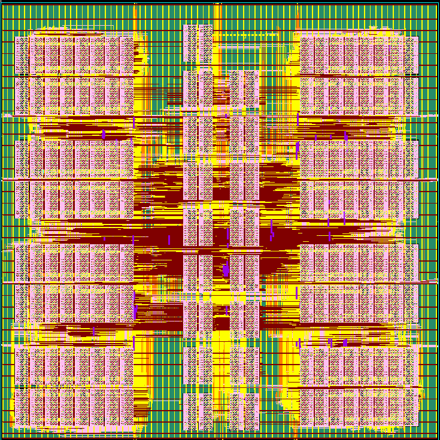

# Author-supplied layout figure

Added to the writing collection on 2026-09-09 after the initial `TSS` delivery
audit. Source: repository-root [layout.jpg](../../../layout.jpg), recorded at
the host revision in [manifest.json](manifest.json). The author intends this
figure to support the hardware implementation and whole-chip results.

The author has confirmed that this image belongs to the simplified layout
phase documented in `TSS`. The existing
[phase handoff](../tss_delivery_20260909/source/stage1_presentation_layout_contract.md)
and [implementation contract](../tss_delivery_20260909/source/stage1_tile_v1/docs/stage1_tile_architecture.md)
are the writing sources for its scope. A further handoff or architecture
confirmation is not required to use the figure.

The [local figure](layout.png) is a byte-identical copy with the correct PNG
extension; the source filename ends in `.jpg`, but the file signature is PNG.
No pixels were edited or regenerated. Resolution: 735 × 735, RGB. Source and
destination SHA-256:
`3264db1d2867e84127bbbb2ae5a41c73ddb835634e55ae2a03d62b7047f7062c`.

## Caption information

| Field | Current record |
|---|---|
| Intended paper use | New layout figure, potentially paired with whole-chip area/energy breakdown |
| Hardware phase | Author-associated with the simplified stage-1 conventional-multiplier layout phase in `TSS`; inspected repository revision `dd6fe890c36effd248b4d0ae56947d7dadfb7dd1` |
| Die/core dimensions | Not reported in the available record; omit numerical dimensions from the caption |
| Implementation description | SMIC 28 nm stage-1 layout study under the phase handoff and final implementation contract |
| Area, timing, and energy sources | Supplied reports in the [TSS snapshot](../tss_delivery_20260909/README.md), retaining their individual measurement stages and boundaries |
| Visible content | Repeated rectangular regions and interconnect/placement structure; no embedded labels or scale |

## Documented simplification

The handoff replaces online multiplier leaves with conventional signed
multipliers and simplifies digit-level control, block timing, and external
interfaces. It retains gate/up mapping, stationary weights, metadata,
reduction trees, and channel accumulators. The final implementation contract
specifies eight owner-lane pairs, 512 signed 8-by-8 leaves, streamed activation
DFF storage, and 136 SRAM macros. Use that implementation contract for details
that evolved from the initial brief's ping-pong buffer/interface description.

The physical phase deliberately excludes model-to-RTL bit equivalence and
cycle-accurate reproduction of the original online-arithmetic experiment.
These are documented study boundaries, not unfinished requirements for
including this layout figure. The active M1 development specification remains
a separate workstream.

Suggested caption:

> Physical layout of the simplified stage-1 TSS implementation. The layout
> study preserves the channel-parallel, block-serial gate/up organization and
> local memory/reduction structure, using conventional fixed-point multiplier
> leaves and the simplified control specified in the phase handoff.

This source image fills the layout-artwork gap identified by the first audit.
It does not supply the missing physical database or extracted timing/power
reports. Those are distinct artifacts, not prerequisites to retaining the
figure as part of the author's writing material.
